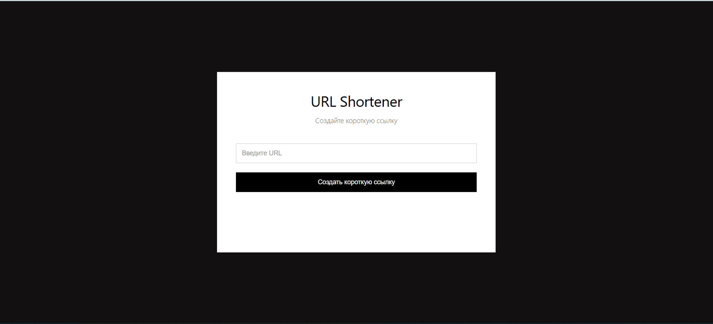
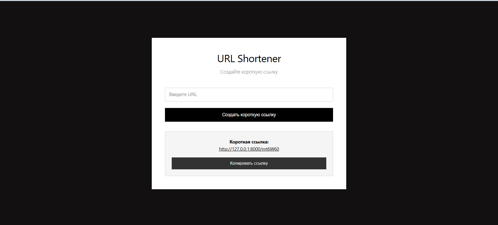
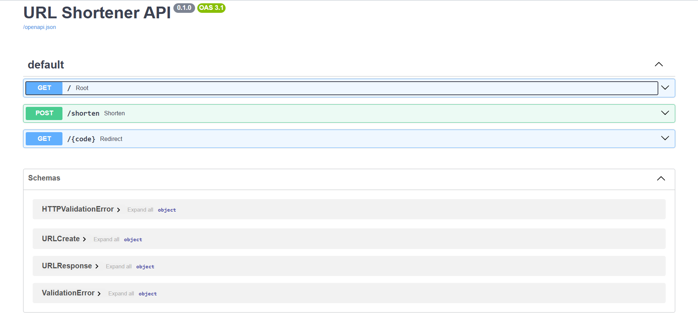
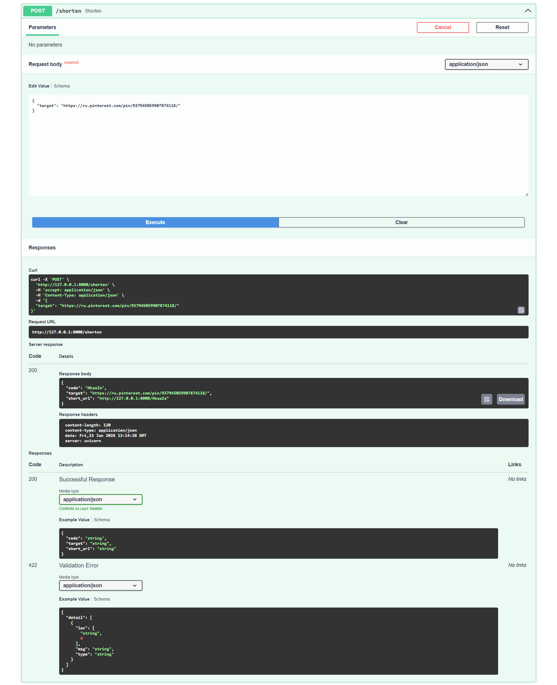
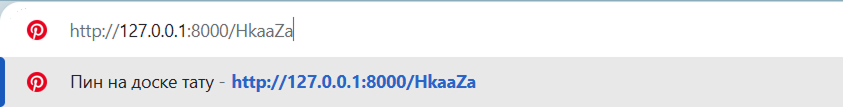
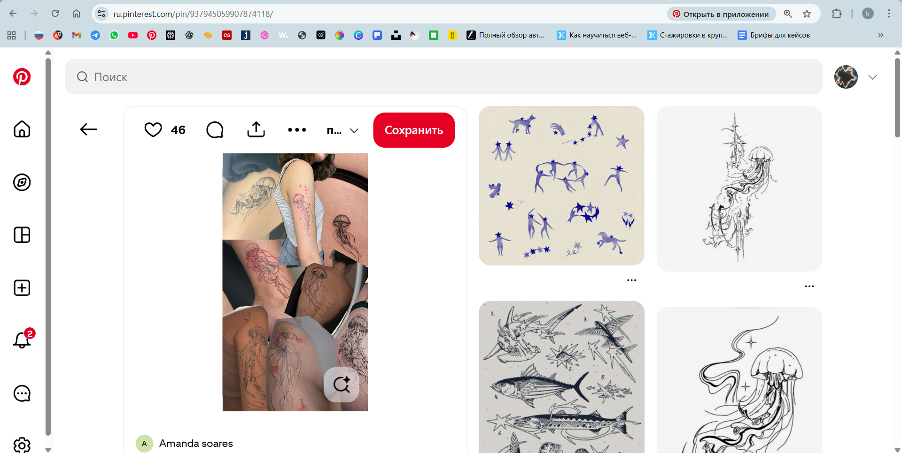

# Скриншоты работающего приложения

## Главная страница

Главная страница с формой для ввода URL.

## Создание короткой ссылки

Отображение созданной короткой ссылки с возможностью копирования.

## API документация (Swagger)

Автоматически сгенерированная документация API доступна по адресу `/docs`.

## Пример использования API

Пример POST запроса к `/shorten` endpoint через Swagger UI.

## Редирект по короткой ссылке

При переходе по короткой ссылке происходит автоматический редирект на исходный URL.

---

