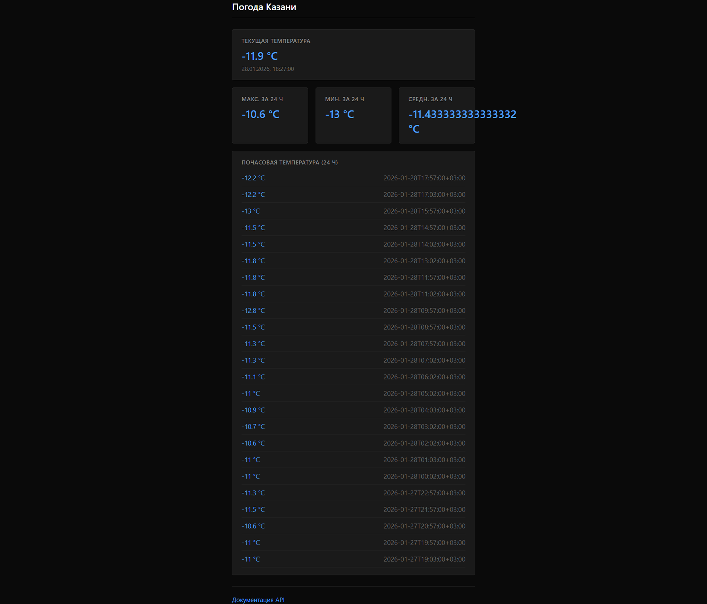
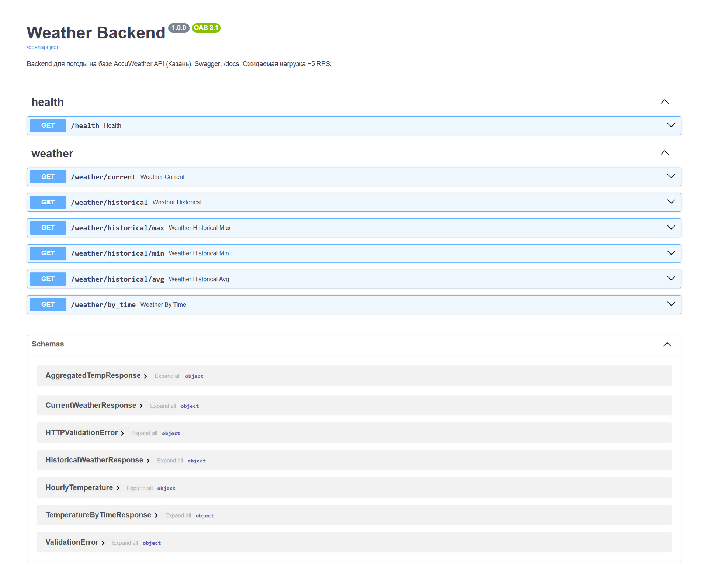
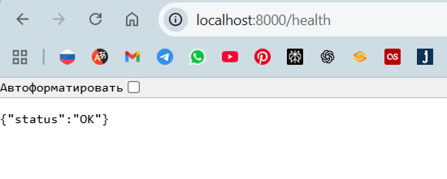
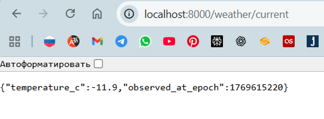
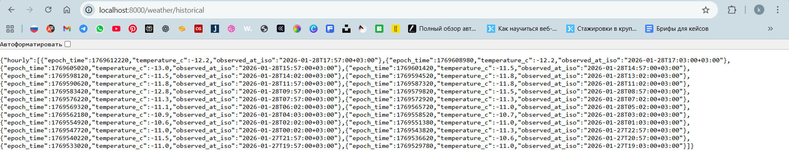
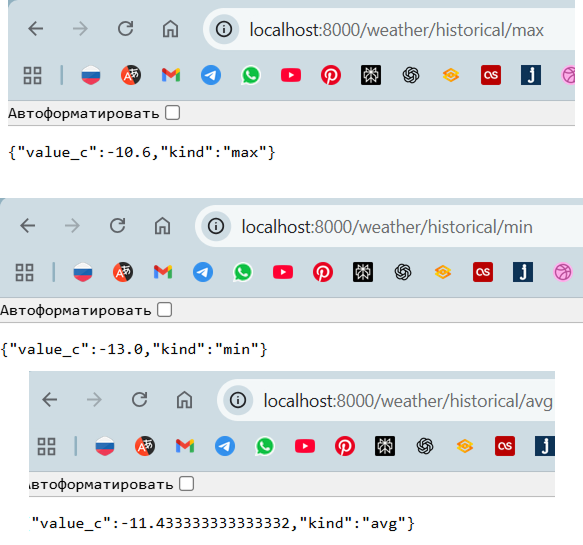
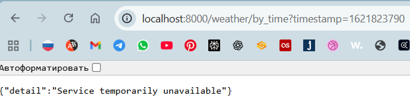

# Скриншоты работающего приложения

---

## 1. Главная страница — веб-интерфейс (Погода Казани)

---

## 2. Документация API (Swagger)

.png)

---

## 3. Ответ эндпоинта /health

---

## 4. Ответ эндпоинта /weather/current

---

## 5. Ответ эндпоинта /weather/historical

---

## 6. Эндпоинты max / min / avg

---

## 7. Эндпоинт /weather/by_time

---

## 8. Запуск тестов

**Команда:** `pytest tests -v`

**Что должно быть на скриншоте:**
- Терминал с результатами прогона тестов (passed/failed), список тестов и общий итог.

*Файл: `screenshots/08-pytest.png`*

---

## 9. Локальный запуск приложения

**Команда:** `python run.py` (или `uvicorn app.main:app ...`)

**Что должно быть на скриншоте:**
- Терминал с сообщением о старте Uvicorn (например, «Uvicorn running on http://0.0.0.0:8000» или «Application startup complete»).

*Файл: `screenshots/09-run.png`*

---
