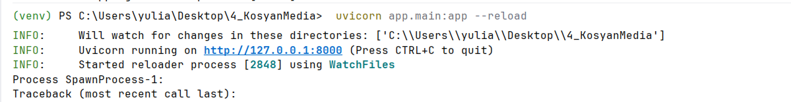
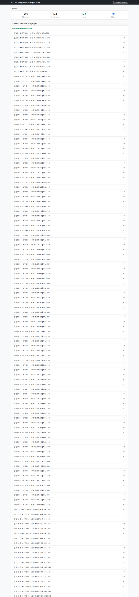
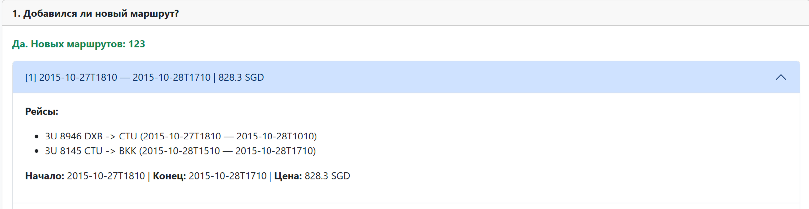
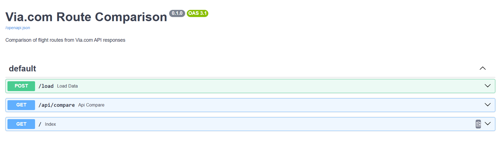

# Скриншоты работающего приложения

---

## 1. Запуск приложения в терминале

Терминал активировано виртуальное окружение `(venv)`, выполнена команда `uvicorn app.main:app --reload`, сервер поднялся на http://127.0.0.1:8000 без ошибок.

---

## 2. Главная страница после загрузки данных

Видна сводка (количество маршрутов в каждом файле, новые, только в первом, общие) и блок «1. Добавился ли новый маршрут?» с раскрывающимися карточками маршрутов.

Раздел «Что изменилось по условиям?» — общие маршруты. Для каждого видно отличия: цена, даты/время, тип (RT/OW). Таблицы с рейсами, временем начала/конца и ценой.

---

## 3. Документация API (Swagger)

Страница `/docs` — автодокументация FastAPI: список эндпоинтов (главная, загрузка данных, JSON API сравнения). Можно вызывать запросы из браузера.

---
