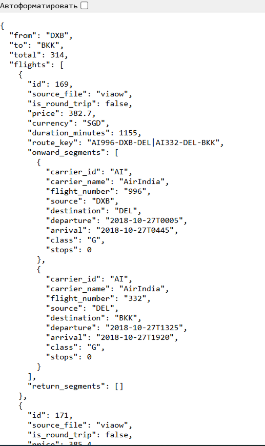
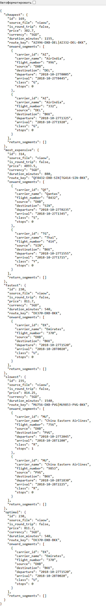
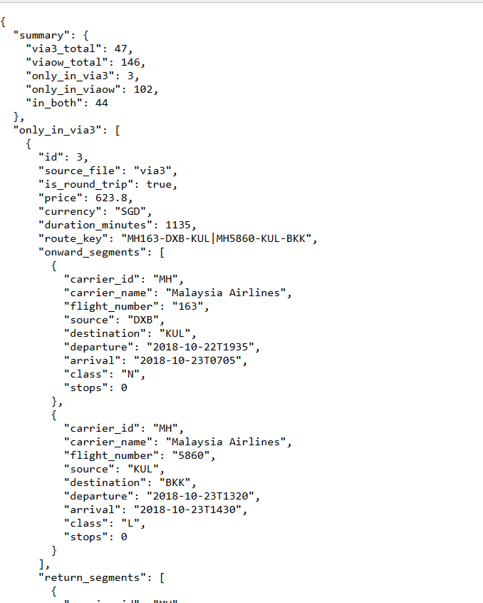
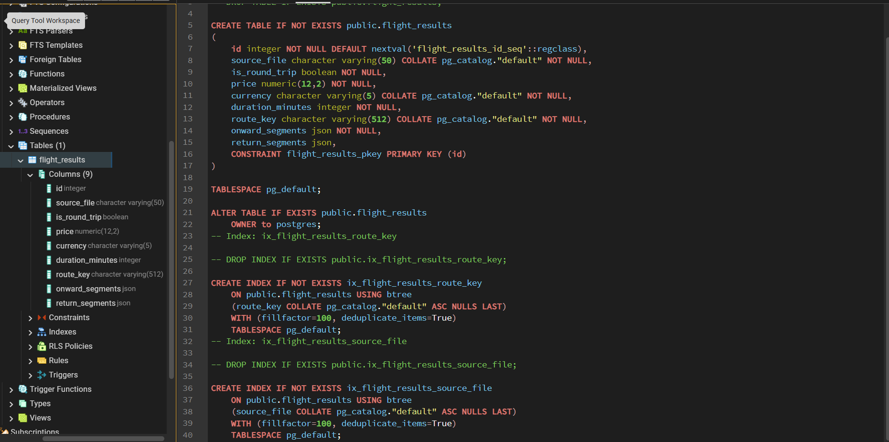
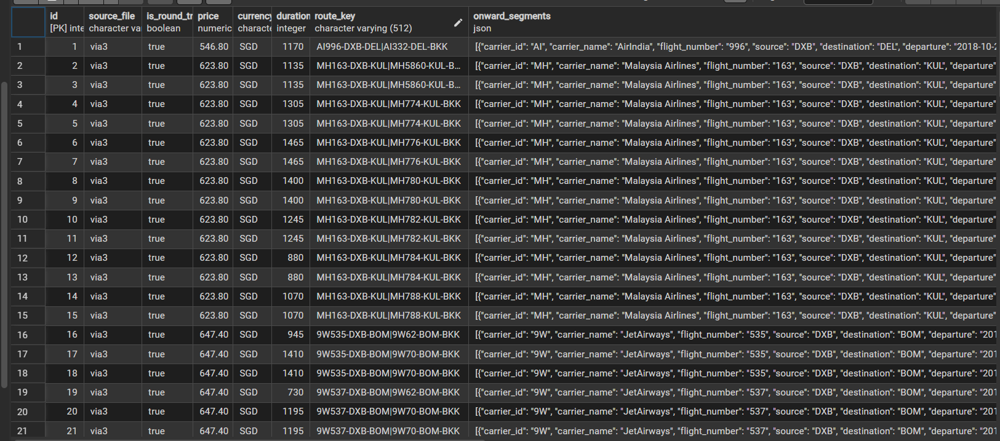

# Скриншоты работающего приложения

## GET /api/flights — все варианты перелётов

Отдаёт JSON со всеми вариантами DXB → BKK из обоих файлов, отсортированными по цене. У каждого варианта есть сегменты маршрута (с какой авиакомпанией, откуда-куда, время вылета/прилёта). На скрине часть ответа, так как он очень длинным получился

---

## GET /api/flights/extremes — экстремумы и оптимальный

Показывает пять вариантов:
- **cheapest** — самый дешёвый
- **most_expensive** — самый дорогой
- **fastest** — самый быстрый
- **slowest** — самый долгий
- **optimal** — лучший по соотношению цена/время

---

## GET /api/diff — сравнение двух запросов

В `summary` видно сколько всего вариантов в каждом файле, сколько уникальных и сколько совпадающих. Для совпадающих маршрутов показана разница в цене и длительности. На скрине часть ответа, так как он очень длинным получился

---

## База данных

Таблица `flight_results` в PostgreSQL — данные загружены автоматически при старте приложения.

---
